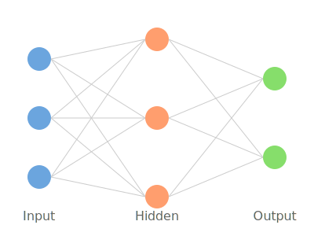

# Deep Q-learning 

In deep Q-learning we use a neural network (Q-network) to estimate an action-value function Q(s,a) ≈ Q*(s,a)

    

We can train this network by adjusting its weights at each iteration to minimize the loss (e.g. MSE) in the Bellman equation. So we are minimizing the following error:

R + γ max Q(s′, a′; w) - Q(s, a; w)

Where the left side of the equation is the y-target

---

Why might the above equation be an issue? 
* by using the same network to compute both Q(s,a) and maxQ(s′, a′) you create a harmful feedback loop 
* the y-target is changing on every iteration, and having a constantly moving target can lead to instabilities and oscillations 

To avoid this issue, we create a separate neural network for generating the y-targets: the target Q-network ( **Q̂** )

So the error becomes:

R + γ max Q̂(s′, a′; w⁻) - Q(s, a; w);  

Where w⁻ and w are the weights of the target network and Q-network, respectively

To update the weights of the target network we use a **soft update** to ensure the target values change slowly:

w⁻ ← τ w + (1 - τ) w⁻

Where τ is a small value (typically << 1) that determines how quickly the target network weights are updated towards the Q-network weights

--- 

**Experience Replay**

* essentially creating a memory buffer of past experiences that the agent can learn from, where each experience is typically stored as a tuple (state, action, reward, next_state, done)
* the buffer has a fixed size and an agent randomly samples mini batches of experiences

